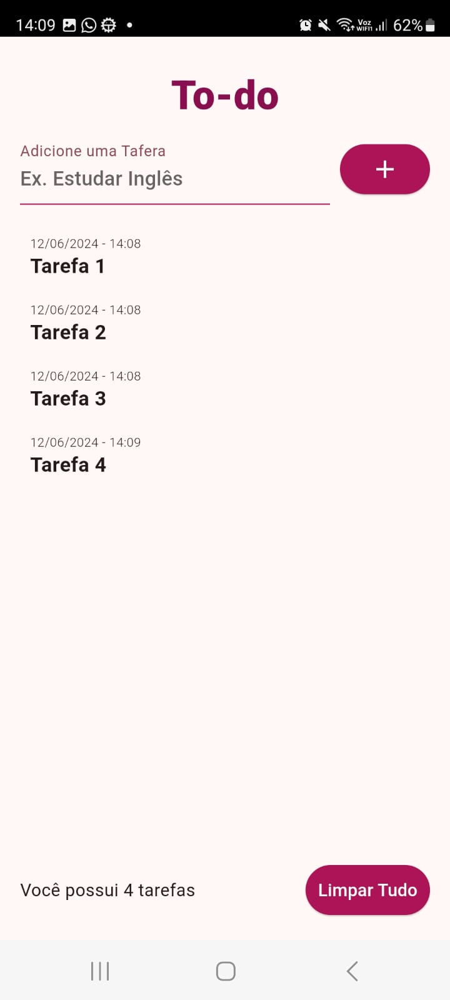
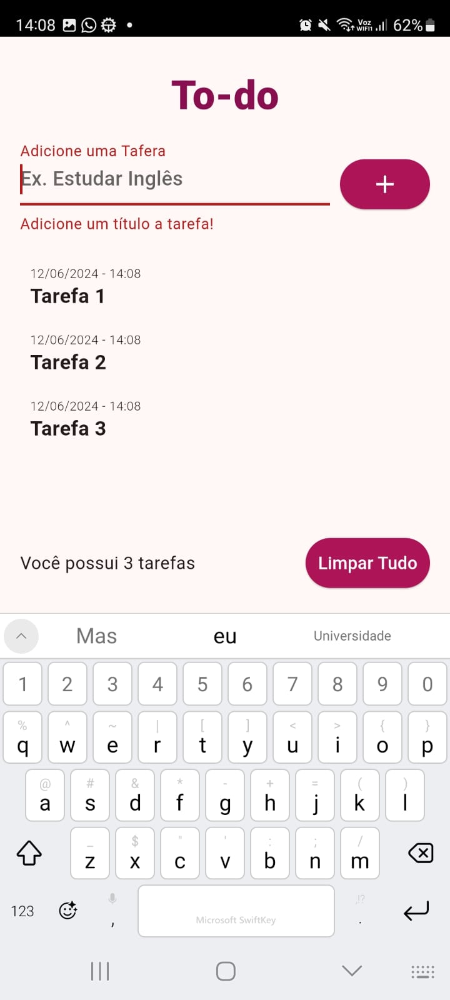
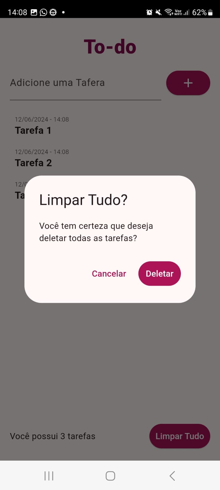

# Aplicativo To-do List

O aplicativo "To-do List" é uma lista de afazeres simples, mas eficaz, projetada para ajudar os usuários a organizar suas tarefas diárias de forma intuitiva e eficiente. Este projeto foi desenvolvido como parte do [curso completo de Flutter disponível na Udemy](https://www.udemy.com/course/curso-completo-flutter-app-android-ios/), que abrange o desenvolvimento de aplicativos para Android e iOS. O objetivo deste projeto é aplicar os conhecimentos adquiridos no curso para criar um aplicativo funcional e atraente.

## Funcionalidades Implementadas em Destaque
- Criação e gestão de listas de tarefas
- Persistência de dados simples para garantir que as tarefas não sejam perdidas ao fechar o aplicativo

## Tecnologias Utilizadas
- Flutter SDK
- Dart
- Android Studio

## Pacotes Adicionais
- `flutter_slidable: ^3.1` - para fornecer uma experiência de usuário melhorada com ações deslizantes em itens da lista
- `shared_preferences: ^2.2.3` - para armazenar dados localmente no dispositivo do usuário

## Demonstração

  
  
  
  

---
